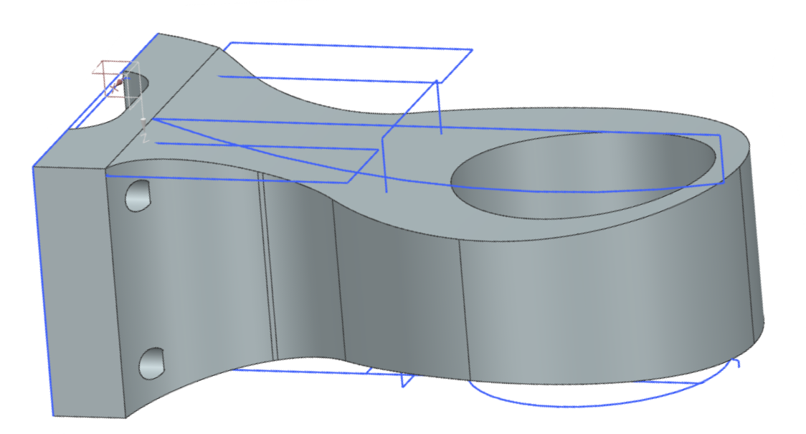
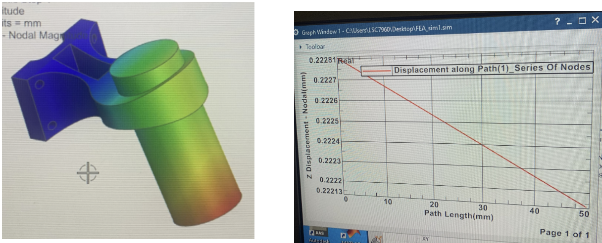
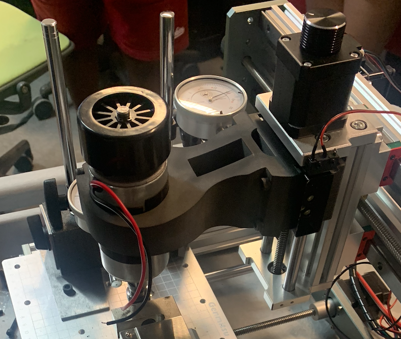

# 3D Printed Milling Machine Mounting Bracket

### Overview

This was a quarter long project during which I and another teammate co-engineered a milling machine bit mounting bracket. The idea was to create a bracket that could be 3D printed for rapid production and replacement, while still being capable of holding a milling machine bit undergoing standard machining operations.

### Design

Our final product had to meet the following design requirements:

1. With a milling machine bit mounted in the bracket and 100N of force applied at the end in either the x, y, or z directions, the end of the bit should deflect less than 2mm from its starting position in any direction.
2. 3D printable, made out of Nylon 12.
3. Less than 1kg of total weight.
4. Maintains a rectangular opening at the center of the bracket to house sensing equipment, such as an accelerometer for vibration testing.

First Iteration:

We opted to make our first bracket iteration as simple as possible, to get a general sense of how much weight would need to be cut as well as making our initial calculations for beam displacement and the life of the part based on oscillating loads and fatigue easier. As such, it did not include a cutout for the accelerometer or a method of tightening the bracket mounting hole.

Our bracket was designed across multiple iterations -- with each, we ran a weight calculation based on the volume of our model and the density of Nylon 12, as well as ran finite element analyses using Siemen's NX. For our FEAs we used a simple beam model in place of a milling machine bit and measured deflection based on forces applied in all directions at the end of the beam. After each analysis, we cut weight where possible and added strength where needed.

We also incorporated general modeling guidelines, such as fillets to avoid sharp corners and concentration stresses. Our printer was capable of handling overhangs and relatively fine details, so we did not have to take those into account when designing for manufacturing.

### Results

After completing our final iteration and running a full-quality 3D print (Nylon 12, 100% Infill, minimal tolerance), we tested our design by mounting a milling machine end mill assembly into our bracket. We then applied 100N of measured force along the x, y, and z axes inward towards the end of the bit, and measured the deflection of the bit from its initial position.

Across the board we managed to remain within our 2mm deflection limit, as well as had a final product under our weight limit of 1kg. We also saw no immediate damage.

[back](./)
