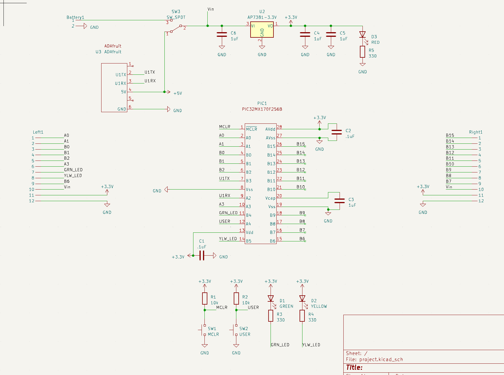
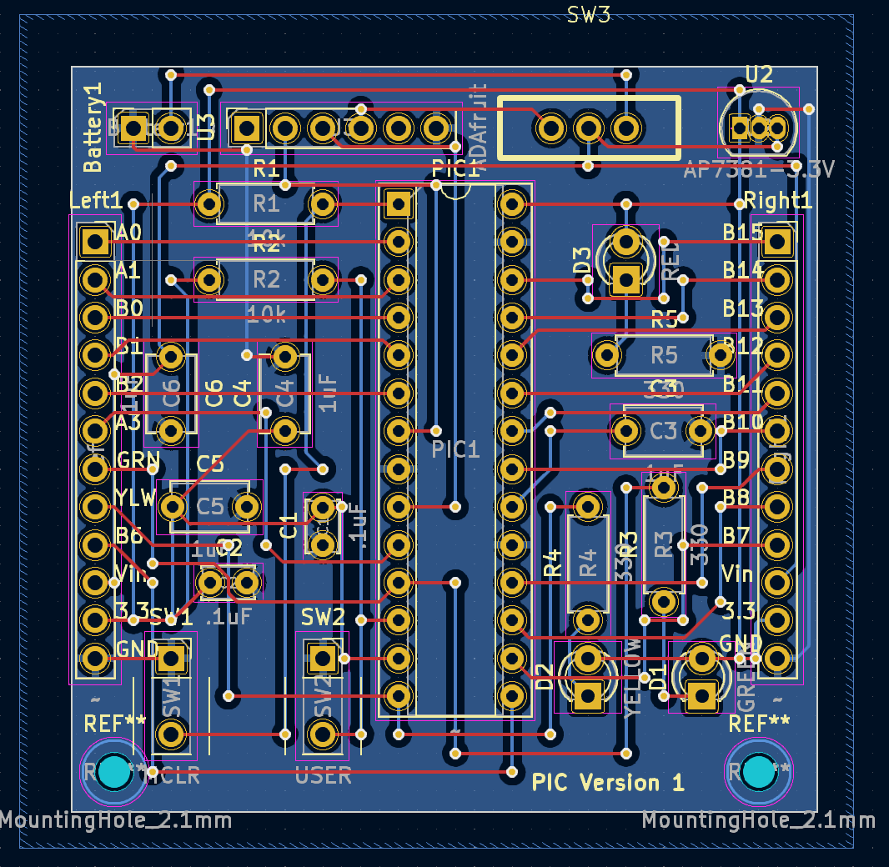
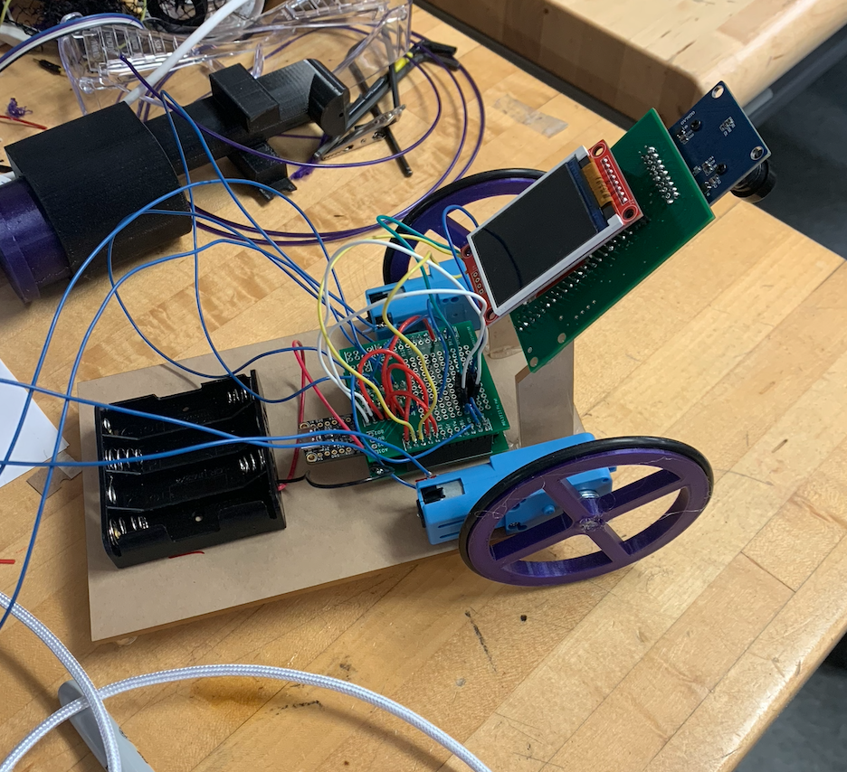

# Line Following Robot

### Overview

The final of my 400-level mechatronics class was to create a wheeled robot capable of following a line, guided by a camera and an image recognition program.

### Electrical and Software Design

I used two wheels and two actuating motors to control the robot. A PIC32MX170F256B microcontroller, programmed in and compiled in C, held command over the robot's motion. The PIC32 and all of my other electrical components were soldered onto a custom PCB I designed in KiCAD and ordered through PCBWay.

Circuit diagram:



Board layout:



Most of the circuit design was just based on the datasheet for the PIC32, which specifies what pins are used for power, for data input/output, where LEDs should go to signal power/data upload, etc. To interface with my computer, I used an Adafruit UART Friend in conjuction with a 3.3V regulator. The actual board is made up of two conducting layers. I used "Manhattan style" connections, where one layer is used to create horizontal connections and the other layer is used for vertical connections. This helps to alleviate possible shorts and makes board design easier.

The program to run the motors is fairly simple, using a PWM signal:

```C
//motor 1
    RPA0Rbits.RPA0R = 0b0101; //Makes A0 OC1
    // Make an output pin for B2
    TRISBbits.TRISB2 = 0;
    LATBbits.LATB2 = 0;
    T2CONbits.TCKPS = 0;     // Timer2 prescaler N=16 (1:16)
    PR2 = 2400;              // period = (PR2+1) * N * (1/48000000) = 50Hz, has to be less than 65000
    TMR2 = 0;                // initial TMR2 count is 0
    OC1CONbits.OCM = 0b110;  // PWM mode without fault pin; other OC1CON bits are defaults
    OC1CONbits.OCTSEL = 0;   // Use timer2
    OC1RS = 600-1;             // duty cycle = OC1RS/(PR2+1) = 25%
    OC1R = 600-1;              // initialize before turning OC1 on; afterward it is read-only
```

To actually turn on the motor you would run OC1RS = (your desired value). To tell each motor when to actuate and by how much, I had a very simple program that essentially said "if the line is to the right of the camera, actuate the left motor, and vice versa."

I had the PIC32 communicating through UART with a PICO W, which is what interfaced with the camera. I had some fairly extensive code written for image/line recognition (modified from the PICO W wiki/guide online). In essence, the software created a horizontal line across the middle of the camera's view, with each pixel in the line being a summation of the colors in each pixel of its respective vertical row. Since the robot was following a black track with a white background, the software could tell where the track was based on the horizontal position of the darkest pixel in the line. It would then send the value of that position to the PIC32, and using that value compared against the total width of the line the PIC32 would know if the robot was centered or not.

[video of the image recognition in action]

### Mechanical Design

The mechanical design was a lot simpler than the electrical and software design. I had a wood board which I mounted my electronics on. I had two wheels attached to the two motors -- both wheels were 3D printed and used press-fitting tolerances to attach to the motors. And I had another wooden mount for my camera, facing down at the track. A spoon underneath the board kept the back of the robot from dragging and reduced frictional contact.

### Result

During our year-end competition, the line following robot was capable of following the track in its entirety, even with the various twists and turns set before it. It did so slowly as the program I wrote to actuate the motors when the camera was off center was fairly basic. If I were to build a second iteration of the robot, I would focus much more on its main controlling program, and would incorporate a feedback control algorithm to allow it to operate faster and smoother.



[back](./)
