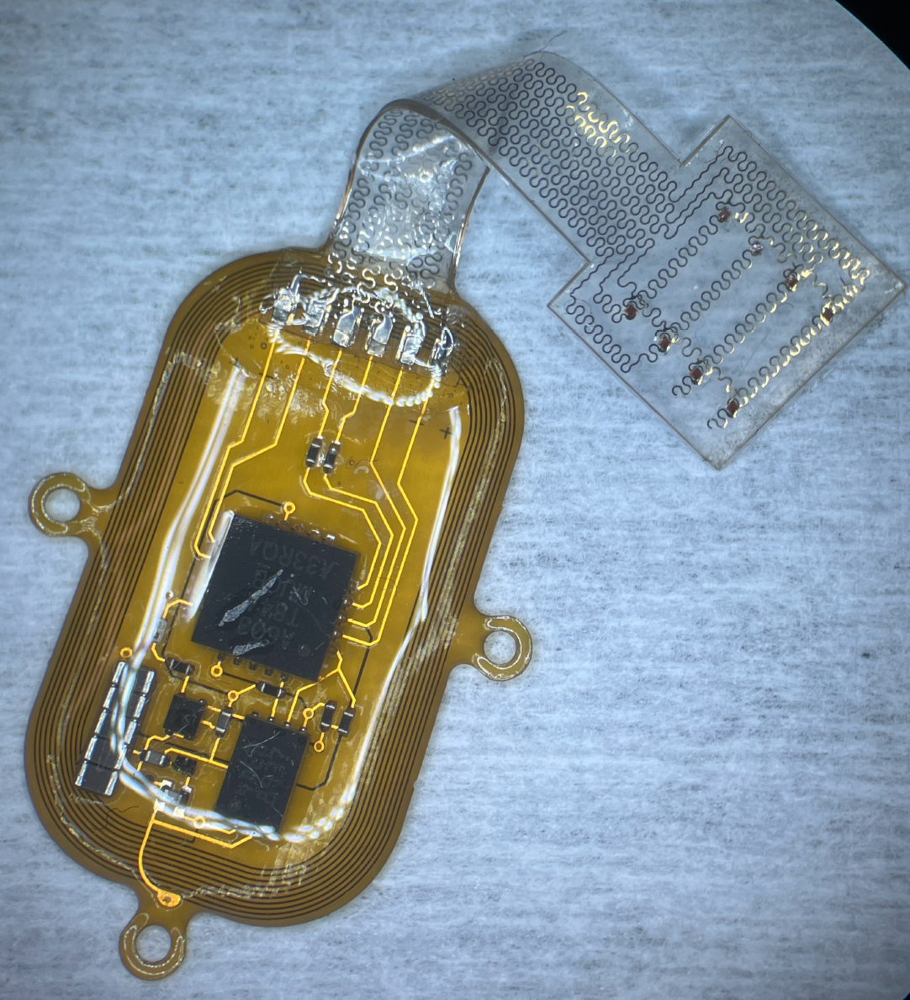
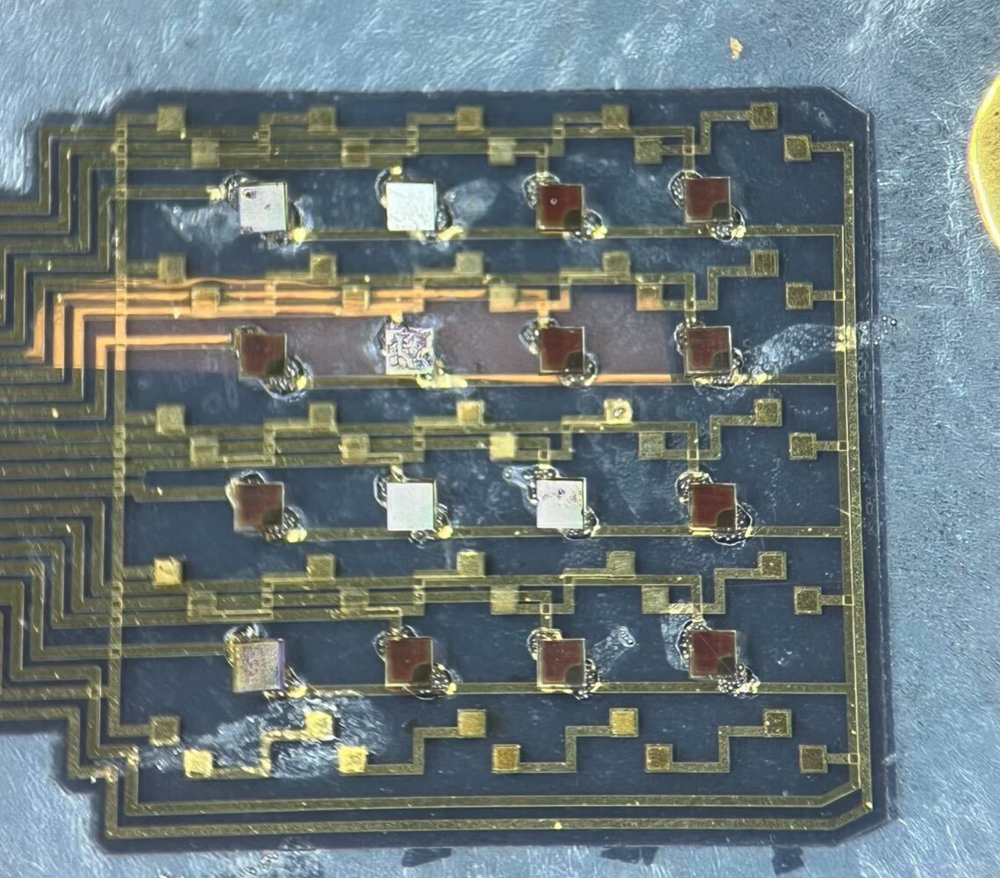

# QSIB Manufacturing Research

### Overview

I spent one of my summers and an academic year working as a student researcher at the Querrey Simpson Institute for Bioelectronics, a Northwestern laboratory also known as the Roger's Lab. The lab specializes in compact, wearable bioelectronic devices built upon flexible PCBs created by Dr. John Rogers. My research was centered around automating the fabrication of such devices using a Pick and Place machine, which was a challenge due to both the small scale of the device components as well as the flexible nature of the PCBs.

### Research

My research was based on the fabrication of 2 different devices, a brain patch and an imaging device, both of which used an array of nanometer-scale diodes to influence the behavior of lab rats. Both were built upon flexible PCBs. While there were some significant technical differences between the two devices, for my purposes they were different variations of the same array, as both used similar LED components.

Brain Patch:

Imaging Device:

Previously, most devices in the lab using components this size were built by hand, using tweezers under a microscope -- an arduous and time-consuming process. My goal was to fully automate the component placement process, so that a fellow researcher could follow simple PCB mounting and solderpaste screen-printing instructions, place the device into the Pick and Place machine, calibrate, and press play.

As such, I compiled 3 main goals:

1. Find the best-performing method of picking up components, which would mainly consist of testing various nozzle sizes as well as machine settings.
2. Develop a proper PCB mounting and/or calibration procedure to ensure accurate component placement.
3. Program the Pick and Place machine to build my two devices and provide instructions to fellow researchers so that my processes could be recreated.

### Methods

While pursuing my first goal, I followed a fairly straightforward process of trial and error, in which I would vary either the size of the nozzle or the amount of suction used (or both). I tested a range of different nozzle sizes, starting from the largest diameter that was still smaller than the width of the LEDs. As the LEDs were around 100x100 microns, this was already fairly small. I then worked my way down to the smallest nozzle available. With each size, I also tested having the suction on or off -- as described in the results section, it turns out that with components this small Van-der-Waals forces are at times all you need.

For my second goal, I conceptualized a couple different methods of PCB mounting/calibration and tested each using the optimal nozzle and settings I eventually found with my first goal:

1. The first method was the standard used throughout the lab with larger components -- simply taping the flexible PCB onto a hard copper plate, and calibrating using two fiducials.
2. The second and newer method was similar to the first, but instead of calibrating off of circular fiducials that were relatively larger compared to the components I calibrated off of the component pads themselves.

For each method, I attempted to use the machine to place LEDs one at a time, instead of running the whole program to place them in sequence. I made sure to note the variations in the LED's actual positions and rotational angles as compared to what was desired, and used that as a baseline to determine which PCB mounting procedure resulted in the highest level of accuracy.

For my third and final goal, I held brief training sections with the brain patch and imaging device teams instructing them on my processes and how to use the programs I wrote.

### Results

I was able to achieve all 3 of my goals, with some surprising results.

* I found that using the smallest available nozzle was almost always preferred, as using larger nozzles increased the risk of erroneous component placement. The LEDs were so small that having a larger nozzle in comparison could lead to incomplete or off-center suction, resulting in components being picked up at an angle.
* Interestingly, I also found that in some cases suction was not needed to lift components. The LEDs were small enough that Van-der-Waals forces alone could lift them. This tended to be advantageous when components were able to be smoothly removed from adhesive-free packaging, and cut out a step in the manufacturing process.
* As for proper PCB mounting and calibration, I found that the standard method of PCB-on-copper-plate was sufficient, however, the most consistent method of making sure the Pick and Place machine was properly aligned with the board was to calibrate not based on fiducials, but by aligning the camera vertical and horizontal axes with a corner of one of the component pads. This allowed less room for operator error and made alignment more visually clear. I took this into account when programming the machine to build these specific devices.

Using my findings, I was able to successfully program the Pick and Place machine to build both devices. I held multiple live demos where I instructed my fellow researchers both on how to use the program, as well as how to create their own for other devices.

## [Back](./)
