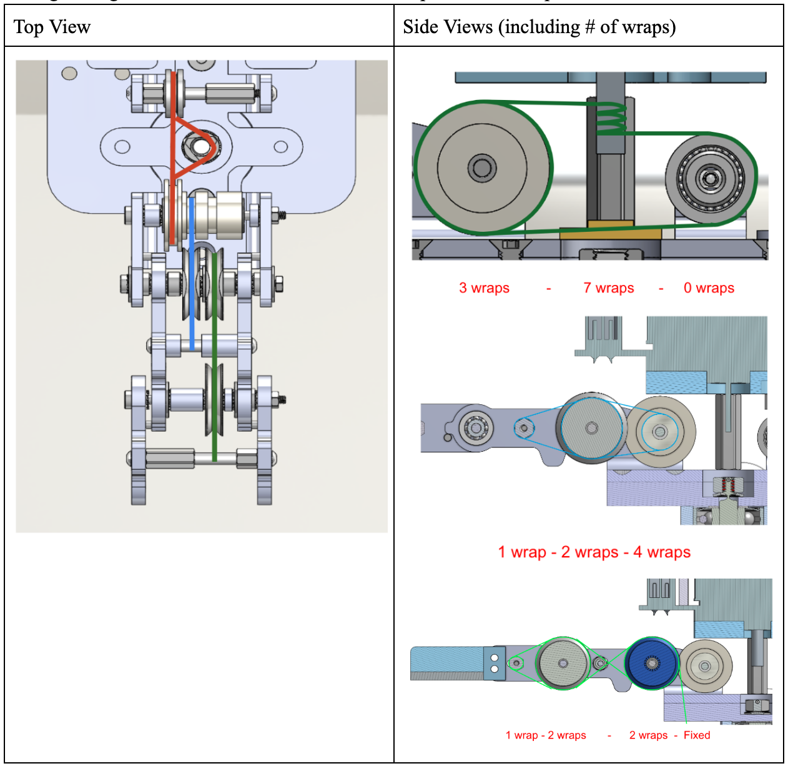
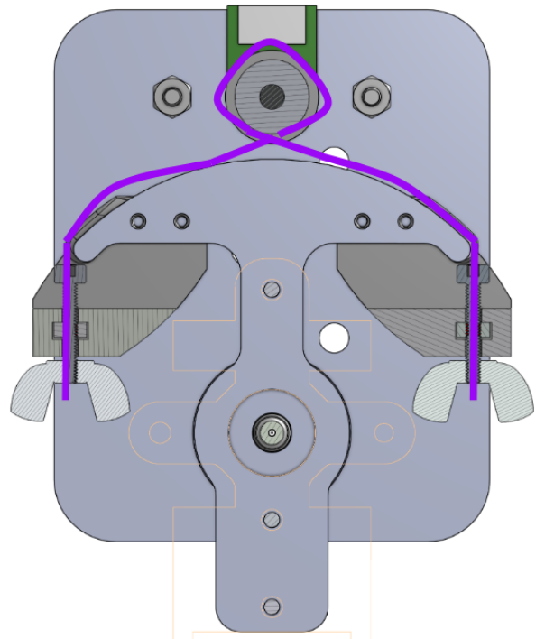
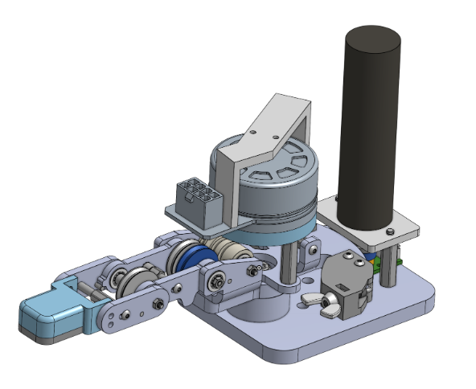
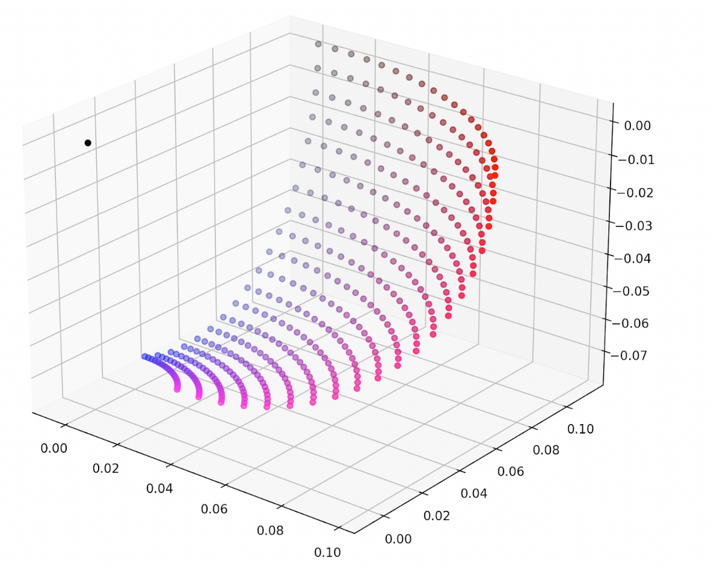
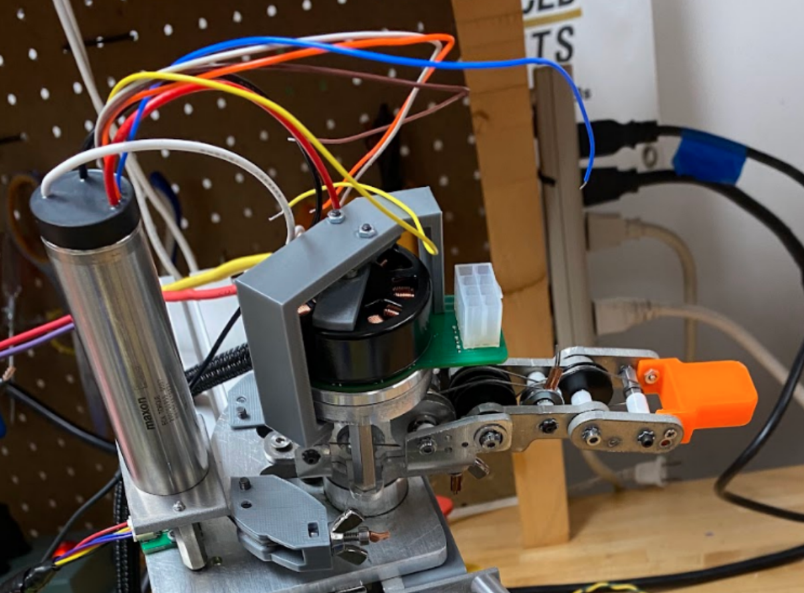

# Robotic Thumb

### Overview

For my 6-month senior capstone project we were tasked with designing and manufacturing a robotic finger and thumb system that could be operated through a haptic controller. We were divided into 4 committees (mechanical, electrical, software, and integration) and 4 teams (robotic finger, robotic thumb, haptic finger, and haptic thumb). I was on the mechanical committee and the robot thumb team -- as such, my primary role was to lead the mechanical design and manufacturing of the thumb, as well as coordinate with mechanical engineers on other teams to ensure a cohesive and properly integrated overall system. This project entry will focus mainly on mechanical and manufacturing considerations.

### Design

Our final product had to meet the following design requirements:

1. Be capable of firmly grasping/manipulating light laboratory objects (ex: vials)
2. Provide real-time haptic feedback to the operator
3. A maximum of 2 actuators (both back-drivable) per robotic appendage
4. Must be designed almost entirely for in-house manufacturing and assembly out of metal

For req. 1, we settled on a target of 1.6-nm of torque applied at the tip of the thumb, based on quick calculations assuming the weight of the lifted object as 1kg (an overestimate), a friction factor of 0.5, and a total thumb length of 0.08m.

We left the incorporation of req. 2 to the haptic thumb team.

Req. 3 was our most significant design constraint, as we wanted to achieve motion in 3 dimensions while being limited to 2 actuators. We achieved this by having one of our motors control two coupled links, while the other controlled a third.

Req. 4 meant we had to design within the constraints of the manufacturing tools we had available. At our disposal was a waterjetting machine, milling machines, lathe machines, FDM 3D printers (to be used minimally), as well as tools for general operations and assembly like bending or press fitting bearings. As a result of these constraints, our final product was made mostly out of machined aluminum and assembled using smaller parts from McMaster-Carr -- more info in the manufacturing section below.

After a prototyping phase in which we used 3D printers to demo various mechanical designs, the mechanical committee settled on a pulley driven "tendon" system, in which robotic links were driven by metal cables. One of the main reasons why we opted for a tendon-based system was to address our concern of backdrivability. The motors needed to be able to move the robotic links, but at the same time the robotic links needed to be able to move the motors. If we physically grabbed a part of the thumb (say, the tip/end-effector) we needed to be able to cause equal motion in the motor shaft itself. This was necessary to make sure that our motor encoders and the actual position of our robotic links remained properly in-sync even after the robot made physical contact with an object. In a similar fashion, backdrivabiltiy made force-feedback in the haptic controller possible. We found that a tendon-based pulley system was optimal in creating backdrivability.

After several iterations we settled upon a final design that utilized two main motions. One motor actuated "curl," essentially the links of the thumb folding inward to apply force upon an object, and the other motor actuated "waggle," a side-to-side motion that would allow the thumb to be properly positioned. This allowed us to achieve 3 dimensions of motion with only 2 motors.

MCP and IP Joints - Curl 
* Actuated with Maxon EC 45 FLAT
* Transmission Ratio 7.94:1 between Motor and MCP Joint
* Coupling Ratio of 1:1 between MCP and IP Joints
* Combined Curl System Can Achieve ~115° ROM at the Thumb Tip - MCP and IP Joints Each Contribute ~57.5° ROM
* Around 1.6Nm of Torque Production at Thumb Tip

CMC Joint - Waggle
* Actuated with Maxon EXC Torque XL
* Transmission Ratio of 7.33:1 between Motor and CMC Joint
* Can Achieve ~90° ROM Around CMC Joint

One of our most significant design concerns (and one of the downsides of a pulley driven system) was cable slippage, which occurs when cables are not sufficiently tensioned around a pulley. Slippage can lead to a discrepency between the motor's rotational input and the actual motion of the robotic links, discrepencies between our motor encoder readings and the actual position of our thumb, and at worst an improperly tensioned cable could leave the motor unable to drive the system at all.

To counter this concern we introduced tensioning mechanisms that would allow us to tighten cables both during assembly and after the system was put together. The waggle tendon was tensioned by tightening wingnuts fixed at each end (shown above). Our curl tendons were tied off to metal bars that could slide along the length of each respective link, and could be tightened by screws to be held in place. By loosening the screws and pulling the cable as far as possible and then re-tightening, proper tension could be created.

Our final CAD design is shown here, with drawings included in the manufacturing section:

This design resulted in the following thumb workspace, basically a 2D surface living in 3D:

### Manufacturing

Most parts were manufactured out of 1/4 inch aluminum sheets. Cylindrical parts (shafts and pulleys) were lathed while flat components were water jetted and then milled to produce proper hole sizes. Occasionally parts were 3D printed out of PLA, most particularly tensioner holders, spacers, and the end effector.
	The overall system is held together by bolts, and locktight in the case of attaching the main waggle bearing shaft to the mounting plate. All components not manufactured by us were ordered from McMaster Carr (ie. bearings, bolts, etc.).

See overall assembly drawings here:

### Results

The final thumb:

Here's a video demonstrating our thumb's capabilities:

[Video](https://www.youtube.com/watch?v=stNRdaBIMV4&feature=youtu.be)

The final system:

We were able to achieve all 4 of our requirements with our design. During our end of year demo, we successfully utilized the system to pick up various objects. Operators were able to remotely feel the force of the items they were grasping as if they were using their own hands. Watch the demo video below:

[demo video]

[back](./)
